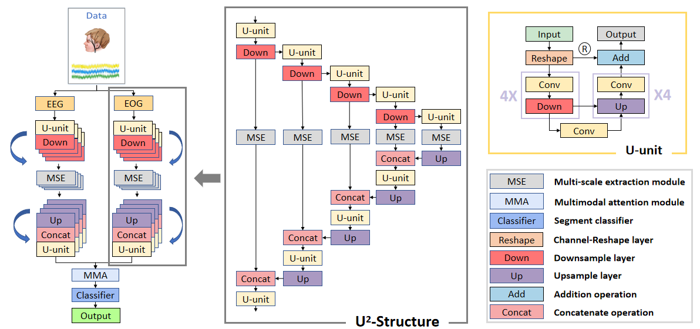

# SalientSleepNet
Code for the model in the paper SalientSleepNet: Multimodal Salient Wave Detection Network for Sleep Staging (Accepted by IJCAI 2021).

# Datasets

>We evaluate the performance of SalientSleepNet on Sleep-EDF-39 and Sleep-EDF-153 datasets, which are open-access databases of polysomnography (PSG) recordings.

# Requirements

* Python 3.7
* Tensorflow 2.3.1

# Function of file

* `construct_model.py`
  * Generate submodule of model (E.g., U-unit, MSE).
* `model.py`
  * Generate single-branch and two-branch model.

# Usage

We've offered two models:  `SingleSalientModel` and `TwoSteamSalientModel` for single-branch method and two-branch method respectively.
You need to use a tensor with shape: **[None, group_sequence_number , group_sequence_length * sleep_epoch_length, 1, 1]** for the single-branch method while duplicate tensors with the same shape for the two-branch method.

